# 2019-NJUHackathon

2019南大第一届腾俱微俱Hackathon大赛参赛项目（第二名）

感谢

[tmzg-98](https://github.com/tmzg-98)

[vigorweijia](https://github.com/vigorweijia)

yuchenyang

一周以来一起爆肝作出的努力

## 项目简介

NJU教务助手安卓app

实现了登录、爬虫，可以在登录后基于教务网的信息进行一系列便捷的操作。

### 主界面

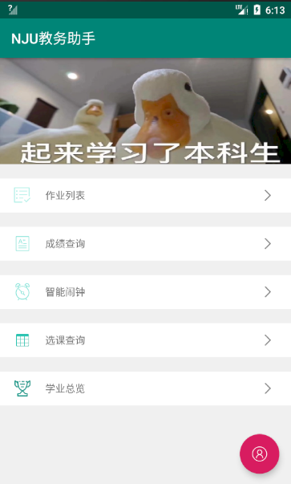

### 登录界面

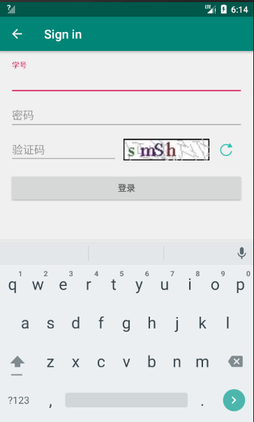

### 作业列表

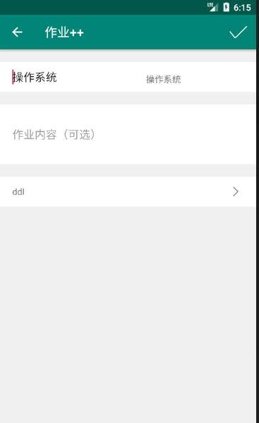

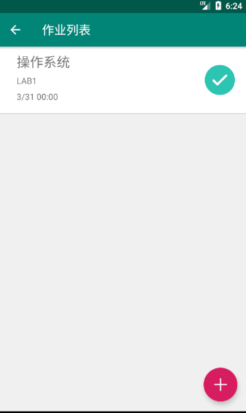

登陆后，可以自动选择本学期的课程作为作业名称

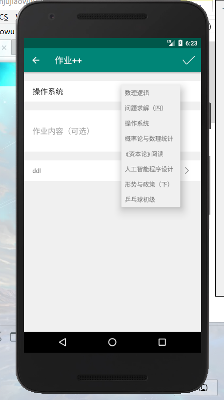

### 成绩查看

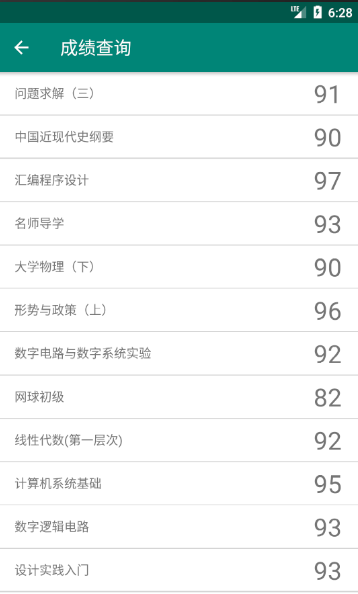

### 智能闹钟

根据第一节早课的时间和时间设置，点击“一键设置时间”，自动设置每天的闹钟时间。（目前的测试版会每隔一段时间自动唤起闹钟界面，即使程序在后台运行）

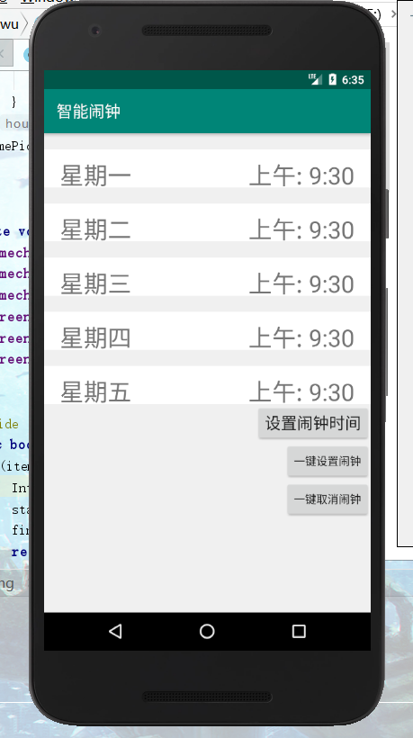

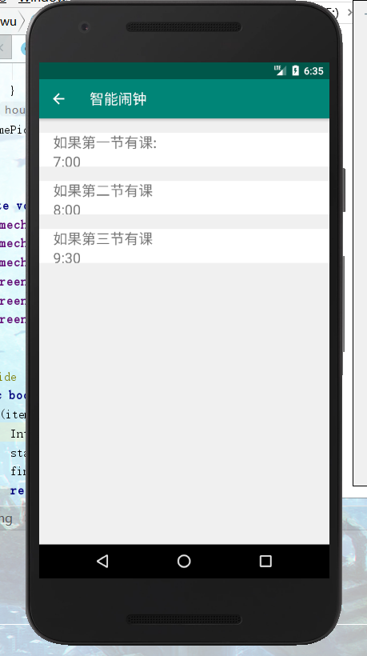

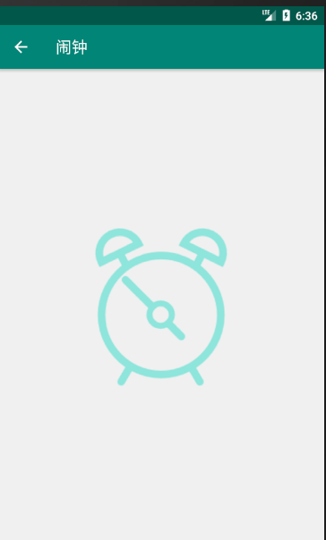

### 选课查询

显示所有的通识课的状态，并模拟抢课。

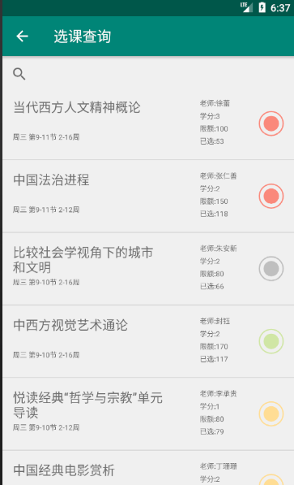

支持按任意内容搜索

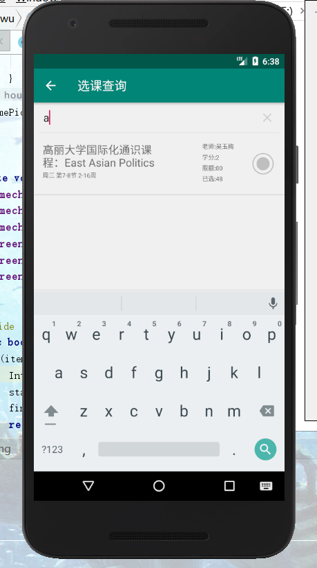

### 学业总览

自动显示学业相关一些的信息，包括总学分数，各类课程的学分数、GPA以及各个学期的学分数、GPA

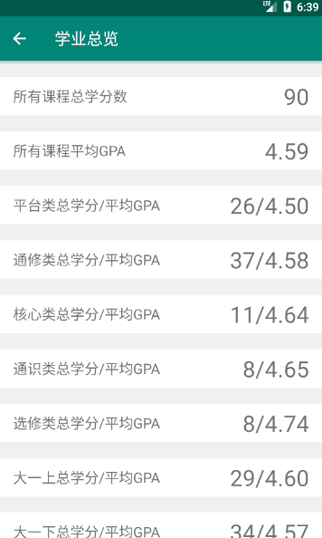
