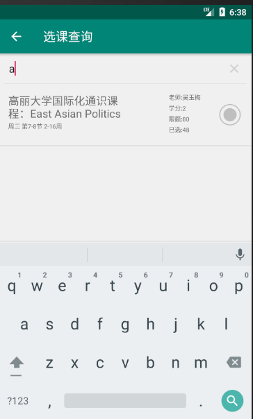

# 2019-NJUHackathon

2019南大第一届腾俱微俱Hackathon大赛参赛项目（第二名）

Project for Nanjing University Microsoft Club and Tencent Club Hackathon (ranked 2nd) 

感谢 Many thanks to

[tmzg-98](https://github.com/tmzg-98)

[vigorweijia](https://github.com/vigorweijia)

yuchenyang

一周以来一起爆肝作出的努力 for the hard work and cooperation during the whole week

## 项目简介 Introduction

NJU教务助手安卓app

实现了登录、爬虫，可以在登录后基于教务网的信息进行一系列便捷的操作。

Nanjing University education administration helper Android app

Implemented log in functionality and a crawler. A series of convenient operations can be performed after logging in to the education administration system of university.

### 主界面 Main page

### 登录界面 Log in page

### 作业列表 Homework TODO list

You can add homework name, detail and deadline here to remind yourself.

登陆后，可以自动选择本学期的课程作为作业名称

After logging in, you can select homework name from the course you have enrolled this semester.

### 成绩查看 Grade viewer

### 智能闹钟 Smart clock

根据第一节早课的时间和时间设置，点击“一键设置时间”，自动设置每天的闹钟时间。（目前的测试版会每隔一段时间自动唤起闹钟界面，即使程序在后台运行）

Set your clock time automatically according to the time of your first course from Monday to Friday.

### 选课查询 Course status viewer

显示所有的通识课的状态，并模拟抢课。

Show the status of all general courses.

支持按任意内容搜索

You can search by course name.

### 学业总览 Academic overview

自动显示学业相关的信息，包括总学分数，各类课程的学分数、GPA，以及各个学期的学分数、GPA

Automatically display academic-related information, including total credits; credits and GPA of different types of courses; credits and GPA of each semester

